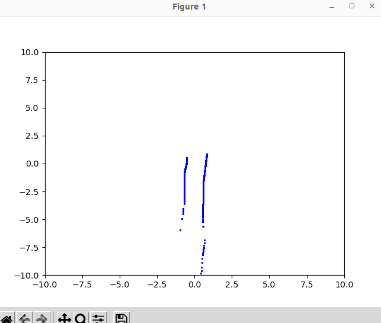
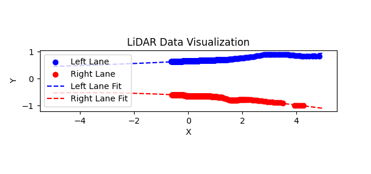

# LiDAR Lane Follower with Visualization

This ROS 2 node processes LiDAR data for lane detection and visualizes the data in real-time.

## Overview

The `LaneCurveDetection` node subscribes to the `/autodrive/f1tenth_1/lidar` topic for LiDAR data. It processes the data to detect lane curves using polynomial fitting and then publishes control commands to the `/autodrive/f1tenth_1/steering_command` and `/autodrive/f1tenth_1/throttle_command` topics.

The visualization of the LiDAR points is displayed in real-time using `matplotlib`.

## Features

- LiDAR data processing
- Lane curve detection using polynomial fitting
- Real-time visualization of LiDAR points
- ROS 2 integration for control commands (steering and throttle)

## Parameters

All variables in the code are set to zero or their default values. These values are placeholders, and you can adjust them to fit your environment as follows:

- **lane_detection_range**: Maximum range for lane detection 
- **min_points_for_fit**: Minimum number of points needed for polynomial fitting 
- **poly_degree**: Degree of the polynomial used for fitting 
- **max_steering_angle**: Maximum steering angle in radians 
- **target_distance**: Distance ahead to calculate lane center 

## Visualization

The following images show how the LiDAR data is visualized during runtime:

### Example 1: Raw LiDAR Points
  
*This image shows the raw LiDAR points with all detected objects in the range of the LiDAR sensor.*

### Example 2: Left and Right Lane Points
  
*This image shows the points separated into left and right lanes based on the polynomial fitting.*

## Usage

To run this node:

1. Make sure ROS 2 and the required dependencies are installed.
2. Clone this repository into your ROS 2 workspace.
3. Build the workspace.
4. Run the following command:

